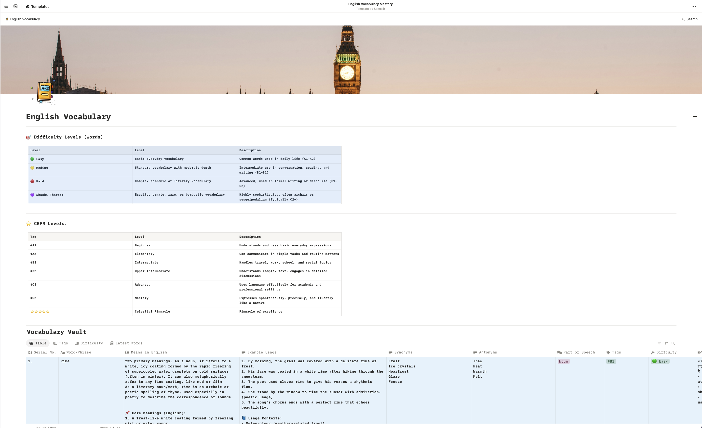
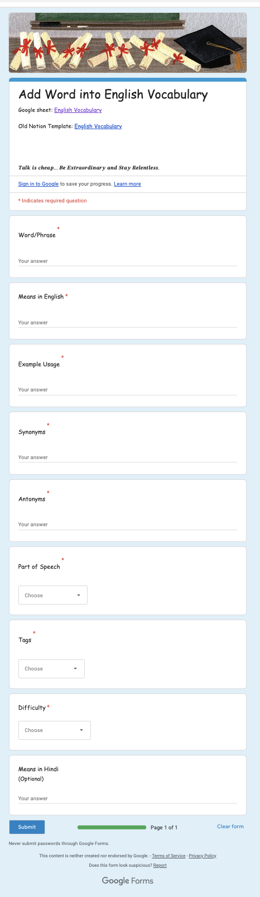
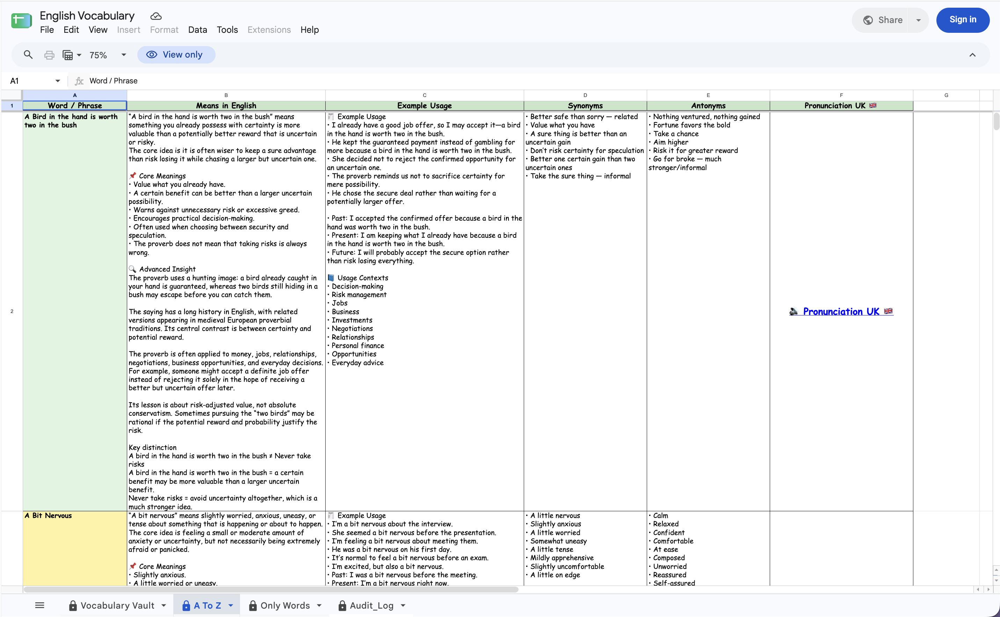
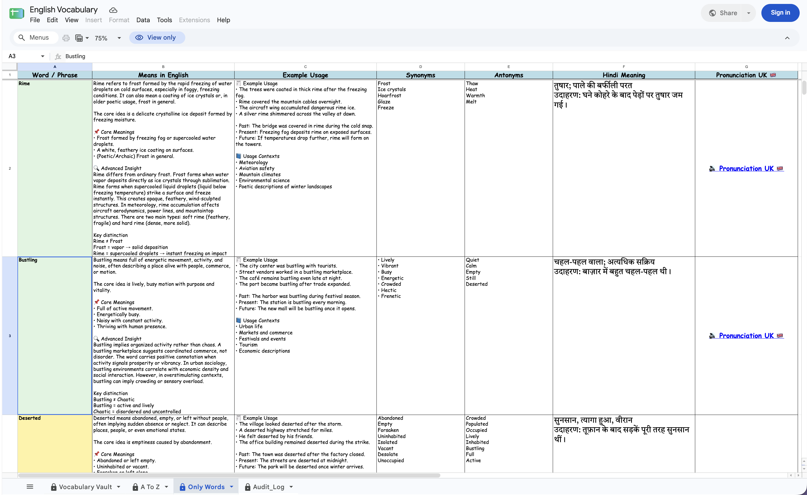
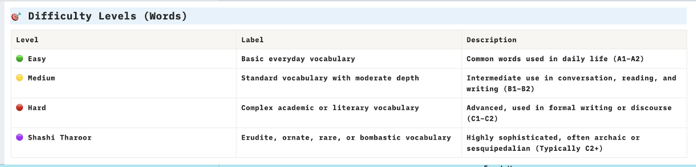
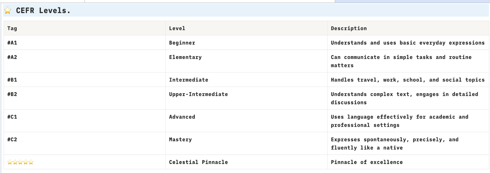
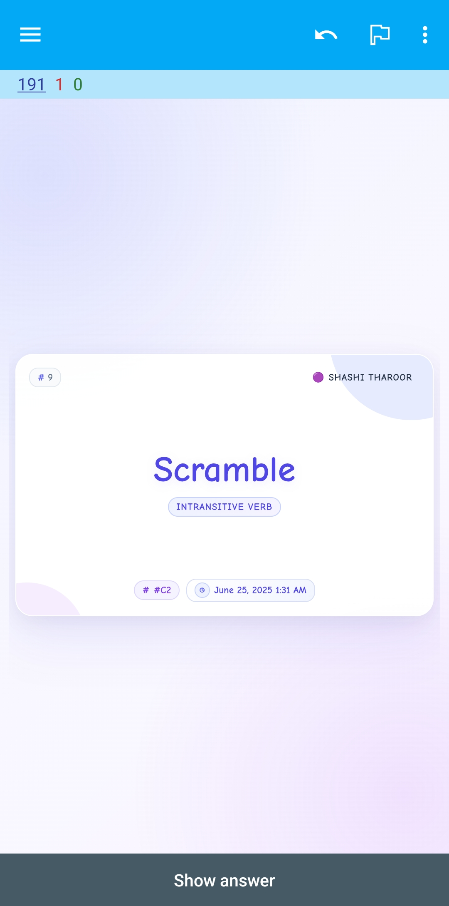
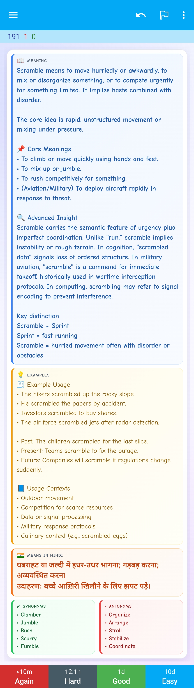

# Vocabulary Vault

> A structured English vocabulary management and learning system built with Google Sheets, Google Apps Script, Google Forms, and Anki.

**Vocabulary Vault** is a personal vocabulary-management and learning system designed to collect, organize, classify, review, and continuously improve a growing English vocabulary collection.

The project combines **Google Sheets** as the primary structured database with a private **Google Apps Script** automation layer for input processing, validation, normalization, duplicate prevention, metadata management, audit logging, Google Form integration, generated vocabulary views, and pronunciation access.

Vocabulary Vault is also connected to an **Anki-based learning workflow** for active recall, spaced repetition, and long-term vocabulary retention.

The project originally began as a structured vocabulary database in **Notion** and later evolved into the current Google Sheets architecture to provide greater control over automation, validation, metadata, custom views, traceability, and long-term maintainability.

---

## Project at a Glance

```text
                         VOCABULARY VAULT
                                │
                 ┌──────────────┴──────────────┐
                 │                             │
                 ▼                             ▼
           Manual Entry                   Google Form
                 │                             │
                 │                       Form_Responses
                 │                             │
                 └──────────────┬──────────────┘
                                │
                                ▼
                     Google Apps Script
                       Automation Layer
                                │
                 ┌──────────────┼──────────────┐
                 │              │              │
                 ▼              ▼              ▼
            Validation     Normalization    Metadata
                 │              │              │
                 └──────────────┼──────────────┘
                                │
                                ▼
                        Duplicate Guard
                                │
                                ▼
                       Vocabulary Vault
                       SOURCE OF TRUTH
                                │
               ┌────────────────┼────────────────┐
               │                │                │
               ▼                ▼                ▼
            A To Z         Only Words        Audit_Log
               │                │
               └────────┬───────┘
                        │
                        ▼
                  Learning & Review
                        │
                        ▼
                       Anki
                        │
                        ▼
                 Spaced Repetition
```

The central architectural principle is simple:

> **Maintain one authoritative vocabulary database and derive specialized learning views from it.**

---

## Live Resources

The project currently spans several connected resources.

| Resource | Purpose |
|---|---|
| [Vocabulary Vault — Google Sheets](https://docs.google.com/spreadsheets/d/14Ag_rNUwVP-BIjj0KJyLUjOb-VFecCvsH6yBcZWnOAs/edit?gid=584521556#gid=584521556) | Primary vocabulary workbook and current database |
| [Vocabulary Submission Form](https://docs.google.com/forms/d/e/1FAIpQLSeurdy8PW2JJQ8Qgj77r1_EF578bXiGnSthQSRPRaypi5BNMQ/viewform?usp=header) | Structured vocabulary submission workflow |
| [Original Notion Vocabulary Database](https://vocabulary-english.notion.site/English-Vocabulary-21ce0aa0c4d380b7b73af79235b5016c) | Earlier version of Vocabulary Vault before migration |
| [AnkiWeb — Vocabulary Flashcards](https://ankiweb.net/shared/by-author/1443764638) | Published Anki resources |
| [GitHub Repository](https://github.com/Someshdiwan/English-Vocabulary) | Public project documentation and architecture |

> Availability and permissions for external Google, Notion, and Anki resources may depend on their current sharing settings.

---

# Features

Vocabulary Vault combines vocabulary management, automation, classification, presentation, and revision into one workflow.

## Vocabulary Management

The primary database supports structured vocabulary information including:

- Word and phrase collection
- Detailed English meanings
- Natural example usage
- Synonyms
- Antonyms
- Part-of-speech information
- Vocabulary tags
- Difficulty classification
- CEFR references
- Hindi meanings and explanations
- Revision-related information
- Creation metadata
- Author information
- Persistent insertion identifiers
- Pronunciation access

The goal is to store enough context to understand a vocabulary item rather than maintaining only a basic `Word → Meaning` list.

---

## Automation

Google Apps Script provides the automation layer behind the workbook.

The production system supports responsibilities such as:

- Input normalization
- Title Case normalization
- Input validation
- Duplicate prevention
- Metadata management
- Author attribution where available
- Creation timestamps
- Internal insertion identifiers
- Audit logging
- Google Form submission processing
- Derived-view regeneration
- Error handling
- Concurrency protection
- Learning-oriented presentation
- British-English pronunciation access

The complete production automation implementation is maintained privately.

The public repository documents its architecture and responsibilities without exposing the complete production algorithms or configuration.

---

## Vocabulary Views

The workbook contains several sheets with distinct responsibilities.

| Sheet | Responsibility |
|---|---|
| `Vocabulary Vault` | Primary structured vocabulary database and source of truth |
| `A To Z` | Generated alphabetical vocabulary view |
| `Only Words` | Generated learning-oriented vocabulary view |
| `Audit_Log` | Automation and change-history records |
| `Form_Responses` | Raw vocabulary submissions from Google Forms |

The generated sheets are intentionally treated as **views**, not independent databases.

---

# Repository Structure

```text
English-Vocabulary/
│
├── README.md
├── LICENSE
├── .gitignore
│
├── apps-script/
│   └── VocabularyVault.gs
│
└── docs/
    ├── assets/
    │   └── vip.gif
    ├── ARCHITECTURE.md
    ├── VOCABULARY-LEVELS.md
    ├── ANKI-FLASHCARDS.md
    │
    └── screenshots/
        ├── vocabulary-vault.png
        ├── form-responses.png
        ├── a-to-z.png
        ├── only-words.png
        ├── difficulty-levels.png
        ├── cefr-levels.png
        ├── Anki-Basic-Front.jpg
        ├── Anki-Basic-Back.jpg
        ├── Anki-Vault-Front.jpg
        └── Anki-Vault-Back.jpg
```

### Repository Responsibilities

```text
README.md
    │
    └── Project overview and navigation

apps-script/
    │
    └── Public automation architecture

docs/
    │
    ├── System architecture
    ├── Vocabulary classification
    ├── Anki documentation
    └── Screenshots

assets/
    │
    └── Reusable project media
```

---

# Vocabulary Vault Database

The `Vocabulary Vault` sheet is the core of the system.

It stores the structured vocabulary collection and acts as the authoritative data source for the rest of the project.

A vocabulary record can contain information such as:

| Field | Purpose |
|---|---|
| Serial No. | Human-readable sequential identifier |
| Word/Phrase | Primary vocabulary item |
| Means in English | English definition and explanation |
| Example Usage | Contextual examples |
| Synonyms | Semantically related vocabulary |
| Antonyms | Semantic opposites |
| Part of Speech | Grammatical classification |
| Tags | Learning and organizational categories |
| Difficulty | Project-specific difficulty classification |
| Means in Hindi | Bilingual explanation |
| Author | Creation attribution where available |
| Revision Count | Revision-related information |
| Created Time | Original creation timestamp |
| Insert ID | Persistent internal entry identity |
| Pronunciation | British-English pronunciation access |

Educational content and system metadata are intentionally separated where practical.

---

# Screenshots

## Vocabulary Vault

The main **Vocabulary Vault** sheet is the project's primary structured database.

It contains the complete vocabulary records, learning information, classifications, and system-managed metadata.



---

## Form Responses

Vocabulary can be submitted through the connected Google Form.

Responses are first received in `Form_Responses` before the supported automation workflow processes them.



---

## A To Z

`A To Z` provides an automatically generated alphabetical representation of the primary vocabulary collection.

It is intended for browsing, searching, reviewing, and quickly navigating vocabulary alphabetically.



---

## Only Words

`Only Words` provides a more focused learning-oriented representation of the vocabulary collection.

It reduces database-oriented information and emphasizes fields useful during vocabulary review.



---

# Vocabulary Classification

Vocabulary Vault uses two complementary classification systems:

```text
Project Difficulty
        +
CEFR Reference
        │
        ▼
Vocabulary Classification
```

## Vocabulary Vault Difficulty

| Level | General Description | Approximate Reference |
|---|---|---|
| Easy | Basic everyday vocabulary | A1–A2 |
| Medium | Standard vocabulary with moderate depth | B1–B2 |
| Hard | Complex academic, formal, or literary vocabulary | C1–C2 |
| Shashi Tharoor | Rare, erudite, ornate, literary, or highly sophisticated vocabulary | Typically advanced |

The **Shashi Tharoor** category is a custom Vocabulary Vault classification. It is not an official CEFR proficiency level.



---

## CEFR References

Vocabulary Vault also uses the standard CEFR proficiency labels as learning references:

```text
A1 — Beginner
A2 — Elementary
B1 — Intermediate
B2 — Upper-Intermediate
C1 — Advanced
C2 — Mastery
```



Official CEFR levels end at **C2**.

Any additional project-specific labels, including **Celestial Pinnacle**, are custom organizational concepts and should not be interpreted as official CEFR levels.

For the complete classification documentation, see:

**[Vocabulary Classification System](docs/VOCABULARY-LEVELS.md)**

---

# System Architecture

Vocabulary Vault uses a layered architecture.

```text
┌─────────────────────────────────────────────────────────┐
│                      INPUT LAYER                        │
│                                                         │
│             Manual Entry       Google Form              │
└──────────────────────────┬──────────────────────────────┘
                           │
                           ▼
┌─────────────────────────────────────────────────────────┐
│                   AUTOMATION LAYER                      │
│                                                         │
│  Normalization │ Validation │ Duplicate Protection      │
│  Metadata      │ Audit      │ Error Handling            │
└──────────────────────────┬──────────────────────────────┘
                           │
                           ▼
┌─────────────────────────────────────────────────────────┐
│                  PRIMARY DATA LAYER                     │
│                                                         │
│                    Vocabulary Vault                     │
│                     SOURCE OF TRUTH                     │
└──────────────────────────┬──────────────────────────────┘
                           │
              ┌────────────┼────────────┐
              │            │            │
              ▼            ▼            ▼
┌────────────────┐ ┌────────────────┐ ┌────────────────┐
│     A To Z     │ │   Only Words   │ │   Audit_Log    │
│ Generated View │ │ Generated View │ │    History     │
└────────────────┘ └────────────────┘ └────────────────┘
              │            │
              └──────┬─────┘
                     ▼
┌─────────────────────────────────────────────────────────┐
│                    LEARNING LAYER                       │
│                                                         │
│              Anki / Spaced Repetition                   │
└─────────────────────────────────────────────────────────┘
```

The architecture separates five major concerns:

1. **Input** — where vocabulary enters the system.
2. **Automation** — how vocabulary is validated and processed.
3. **Storage** — where authoritative vocabulary information is maintained.
4. **Presentation** — how specialized vocabulary views are generated.
5. **Learning** — how structured vocabulary becomes a revision resource.

For the complete technical design, see:

**[Architecture Documentation](docs/ARCHITECTURE.md)**

---

# Entry Processing

A supported vocabulary entry conceptually moves through the following pipeline:

```text
Input
  │
  ▼
Normalize
  │
  ▼
Validate
  │
  ▼
Duplicate Check
  │
  ├──── Duplicate ────► Reject / Record
  │
  ▼
Accepted
  │
  ▼
Metadata Processing
  │
  ▼
Vocabulary Vault
  │
  ├──────────────────► Audit_Log
  │
  ▼
Derived View Refresh
  │
  ├──────────────────► A To Z
  │
  └──────────────────► Only Words
```

Centralizing these operations helps keep vocabulary processing consistent regardless of the supported input route.

---

# Google Form Workflow

Vocabulary Vault includes a connected Google Form for convenient structured vocabulary submission.

**[Open the Vocabulary Submission Form](https://docs.google.com/forms/d/e/1FAIpQLSeurdy8PW2JJQ8Qgj77r1_EF578bXiGnSthQSRPRaypi5BNMQ/viewform?usp=header)**

A submission can contain fields such as:

```text
Word/Phrase
Means in English
Example Usage
Synonyms
Antonyms
Part of Speech
Tags
Difficulty
Means in Hindi
```

Google Forms also records the submission timestamp.

The workflow is conceptually:

```text
User
 │
 ▼
Google Form
 │
 ▼
Form_Responses
 │
 ▼
Apps Script
 │
 ├── Normalize
 │
 ├── Validate
 │
 ├── Duplicate Check
 │
 └── Metadata Processing
 │
 ▼
Vocabulary Vault
```

This makes it possible to submit vocabulary through a simpler interface without directly editing the primary database.

---

# Automation Architecture

Google Apps Script acts as the orchestration layer between input, storage, generated views, and audit history.

The production implementation is responsible for operations such as:

```text
Input Processing
       │
       ├── Normalization
       ├── Validation
       └── Duplicate Protection
       │
       ▼
Metadata Management
       │
       ├── Attribution
       ├── Creation Information
       └── Internal Identity
       │
       ▼
Primary Database
       │
       ├────────────► Audit Logging
       │
       ▼
Generated Views
       │
       ├────────────► A To Z
       └────────────► Only Words
```

The public `apps-script/VocabularyVault.gs` file documents the code-level architecture and major responsibilities.

The complete production automation implementation remains private.

---

# British-English Pronunciation

Vocabulary Vault includes direct pronunciation access for vocabulary entries.

The main pronunciation column uses spreadsheet-level formula expansion rather than requiring Apps Script to write a pronunciation value individually to every row.

Conceptually:

```text
Word/Phrase
     │
     ▼
Google Sheets Formula
     │
     ▼
Pronunciation Search
     │
     ▼
British-English Reference
```

The search intent follows the pattern:

```text
<Word/Phrase> pronunciation British English
```

This design provides:

- Automatic expansion for new vocabulary
- Minimal script interaction
- Simple maintenance
- Direct relationship with the source word
- Convenient British-English pronunciation access

Google controls the resulting search interface and pronunciation content.

Vocabulary Vault does not treat Google Search as a formal pronunciation API.

---

# Source of Truth

The most important architectural rule in the project is:

```text
Vocabulary Vault = Source of Truth
```

Other components have specialized roles:

```text
Google Form
     │
     └── Input Interface

Form_Responses
     │
     └── Raw Submission Layer

Vocabulary Vault
     │
     └── Authoritative Database

A To Z
     │
     └── Generated Alphabetical View

Only Words
     │
     └── Generated Learning View

Audit_Log
     │
     └── History / Observability

Anki
     │
     └── Learning / Revision Layer
```

This prevents the project from becoming several independently maintained copies of the same vocabulary collection.

---

# Project Evolution

Vocabulary Vault did not begin with its current architecture.

The original vocabulary collection was maintained in **Notion**.

**[View the Original Notion Vocabulary Database](https://vocabulary-english.notion.site/English-Vocabulary-21ce0aa0c4d380b7b73af79235b5016c)**

As the collection grew, the project required more control over:

- Input validation
- Normalization
- Duplicate prevention
- Metadata
- Record identity
- Automated processing
- Custom learning views
- Audit logging
- Form-based vocabulary submission
- Revision workflows
- Pronunciation access
- Long-term maintainability

The project therefore evolved from:

```text
Notion
  │
  ▼
Structured Vocabulary Database
  │
  ▼
Google Sheets
  │
  ▼
Google Apps Script
  │
  ▼
Automated Vocabulary Vault
  │
  ▼
Generated Learning Views
  │
  ▼
Anki / Spaced Repetition
```

The Notion version remains part of the project's history, while Google Sheets is the basis of the current architecture.

---

# Anki Flashcards

Vocabulary Vault extends beyond vocabulary storage.

Structured vocabulary information is also transformed into **Anki flashcards** designed for:

- Active recall
- Repeated retrieval
- Spaced repetition
- Vocabulary reinforcement
- Long-term retention

A flashcard can contain information such as:

- Word/Phrase
- Meaning in English
- Core meanings
- Advanced insight
- Semantic distinctions
- Natural example usage
- Usage contexts
- Synonyms
- Antonyms
- Part of speech
- Hindi meaning
- Difficulty classification
- CEFR references
- Selected metadata

The learning workflow is:

```text
Vocabulary Vault
       │
       ▼
Structured Vocabulary
       │
       ▼
Anki Flashcards
       │
       ▼
Active Recall
       │
       ▼
Spaced Repetition
       │
       ▼
Long-Term Retention
```

---

## Anki Card Preview

### Vocabulary Vault — Front



### Vocabulary Vault — Back



The repository also contains examples of the earlier/basic card design to document the evolution of the flashcard interface.

---

## AnkiWeb

Published Anki resources associated with the project can be found here:

**[Vocabulary Vault on AnkiWeb](https://ankiweb.net/shared/by-author/1443764638)**

> **Note:** `Dummy Flashcards.png` contains dummy demonstration cards only and does not represent the original Vocabulary Vault Anki collection.

> **Important:** The complete Vocabulary Vault flashcard collection and all associated deck resources are not necessarily included in this GitHub repository.

The complete collection is distributed separately as a **paid digital resource**.

For full details about card structure, learning philosophy, availability, and usage conditions, see:

**[Anki Flashcards Documentation](docs/ANKI-FLASHCARDS.md)**

For availability, pricing, or access to the complete collection:

**Email:** someshdiwan@icloud.com

When contacting, mention:

```text
Vocabulary Vault — Anki Flashcards
```

---

# Public Repository vs Production System

This repository is intended to document and showcase the engineering and learning architecture of Vocabulary Vault.

It does not publish every implementation detail of the production system.

## Public Repository

The repository documents:

```text
Project overview
System architecture
Data-flow design
Automation responsibilities
Vocabulary classification
CEFR references
Anki workflow
Representative screenshots
Public Apps Script architecture
Project evolution
```

## Private Production Implementation

Implementation-specific information retained privately can include:

```text
Complete production Apps Script
Exact production configuration
Internal field mappings
Validation implementation
Normalization algorithms
Duplicate-detection implementation
Metadata-generation algorithms
Internal identity strategy
Audit event schema
Form-processing mappings
Regeneration algorithms
Production formulas
Presentation configuration
Concurrency configuration
Complete vocabulary dataset
Complete commercial Anki collection
```

This separation allows the project architecture to be demonstrated without publishing a directly reproducible copy of the production environment or separately distributed learning resources.

---

# Documentation

Detailed documentation is maintained in the `docs` directory.

| Document | Description |
|---|---|
| [Architecture](docs/ARCHITECTURE.md) | System architecture, components, processing pipelines, and data flow |
| [Vocabulary Levels](docs/VOCABULARY-LEVELS.md) | Difficulty model, CEFR references, and custom classification |
| [Anki Flashcards](docs/ANKI-FLASHCARDS.md) | Flashcard structure, learning model, previews, availability, and distribution |

The public Apps Script architecture is available at:

```text
apps-script/VocabularyVault.gs
```

---

# Design Principles

Vocabulary Vault is built around several core principles.

### Single Source of Truth

Maintain one authoritative vocabulary database rather than several competing copies.

### Separation of Concerns

Input, processing, storage, presentation, audit history, and revision each have clearly defined responsibilities.

### Automation Over Repetition

Automate repetitive database-management operations where automation improves consistency and reliability.

### Derived Views

Generate alternative learning representations from the primary dataset instead of manually maintaining duplicate databases.

### Traceability

Maintain enough system history to understand important automation activity and support future reliability features.

### Structured Learning

Store vocabulary in a form that captures meaning, context, relationships, grammar, bilingual understanding, and classification.

### Long-Term Retention

Connect vocabulary management with active recall and spaced repetition rather than treating collection itself as the final goal.

---

# Roadmap

The architecture is designed to support future extensions without replacing the core data model.

Potential future capabilities include:

- Improved revision tracking
- Version history
- Entry rollback
- Conflict detection
- Automated snapshots
- JSON export
- CSV export
- Public read-only dictionary view
- Quick-add workflows
- Tag-based views
- Vocabulary analytics
- Search and filtering improvements
- Additional learning views
- Improved Anki synchronization

Future functionality should continue to preserve the central rule:

```text
One Authoritative Vocabulary Database
                 +
Specialized Automation
                 +
Derived Learning Views
```

---

# Feedback, Mistakes & Corrections

Vocabulary Vault is continuously maintained and improved.

Because the project contains linguistic information, translations, classifications, examples, and learning references, occasional mistakes or reasonable classification differences may occur.

Corrections are particularly welcome for:

- English meanings
- Hindi meanings
- Example usage
- Grammar
- Parts of speech
- Synonyms
- Antonyms
- Vocabulary tags
- Difficulty classifications
- CEFR references
- Pronunciation references
- Documentation
- Automation behavior

## Reporting an Issue

The preferred method is to open a **GitHub Issue** in this repository.

When reporting a vocabulary issue:

1. Identify the affected word or phrase.
2. Describe the incorrect or unclear information.
3. Provide the suggested correction.
4. Include a reliable linguistic reference where appropriate.

For project or vocabulary-related communication, you can also contact:

**someshdiwan@icloud.com**

Constructive corrections and suggestions that improve the accuracy, maintainability, or learning quality of Vocabulary Vault are welcome.

---

# Classification Disclaimer

Vocabulary difficulty is contextual.

A word that is difficult for one learner may already be familiar to another.

The project's:

```text
Easy
Medium
Hard
Shashi Tharoor
Celestial Pinnacle
```

labels are organizational and learning aids used within Vocabulary Vault.

They should not be interpreted as standardized language-proficiency classifications.

Similarly, assigning an individual vocabulary item an approximate CEFR reference does **not** constitute a formal CEFR assessment.

Official CEFR proficiency levels range from:

```text
A1 → A2 → B1 → B2 → C1 → C2
```

For detailed classification methodology and limitations, see:

**[Vocabulary Classification System](docs/VOCABULARY-LEVELS.md)**

---

# License

The source code published in this repository is licensed under the
[MIT License](LICENSE).

The MIT License applies **only to the source code made publicly available
in this repository**.

> **Important:** The MIT License applies to the source code in this repository.
> The Vocabulary Vault dataset, vocabulary content, educational material,
> flashcard content, Anki flashcard collection, deck packages, card designs,
> and other separately distributed learning resources are **not licensed for
> unrestricted redistribution, resale, republication, or commercial use**
> unless explicitly stated otherwise.

This distinction is important because Vocabulary Vault contains multiple
types of material with different distribution purposes.

## Source Code

Publicly released source code covered by the repository's MIT License may
include code intentionally published in directories such as:

```text
apps-script/
```

Only the code actually made available in the public repository should be
considered part of the publicly released source-code distribution.

The MIT License permits use of that published source code subject to the
terms and copyright notice contained in the [LICENSE](LICENSE) file.

---

## Vocabulary Dataset and Educational Content

The structured Vocabulary Vault collection contains original organization,
curation, explanations, examples, classifications, translations, learning
material, and other educational content.

Unless explicitly stated otherwise, publishing project documentation or
screenshots in this repository should **not** be interpreted as granting
permission to reproduce or redistribute the complete Vocabulary Vault
dataset or educational collection.

This includes, where applicable:

- Structured vocabulary records
- Vocabulary explanations
- Core meanings
- Advanced insights
- Example collections
- Semantic distinctions
- Hindi explanations
- Custom vocabulary classifications
- Curated vocabulary relationships
- Complete exported datasets
- Commercial learning resources

---

## Anki Flashcard Collection

The complete Vocabulary Vault Anki flashcard collection is distributed
separately from the public source-code repository.

Unless explicitly permitted, access to an Anki deck does not grant
permission to:

- Resell the deck
- Redistribute complete deck files
- Upload the collection to another public platform
- Publish copies of the complete flashcard database
- Repackage the collection for commercial distribution
- Sell modified copies of the collection
- Claim the flashcard content or card design as original work
- Include the complete collection in another paid product

Screenshots and previews included in this repository are provided primarily
to demonstrate the learning experience and project design.

For information about the separately distributed Anki collection, see:

**[Anki Flashcards Documentation](docs/ANKI-FLASHCARDS.md)**

Published Anki resources:

> **Note:** `Dummy Flashcards.png` contains dummy demonstration cards only and does not represent the original Vocabulary Vault Anki collection.

**[Vocabulary Vault on AnkiWeb](https://ankiweb.net/shared/by-author/1443764638)**

For availability, pricing, or access:

**someshdiwan@icloud.com**

---

## Public Documentation

Documentation contained in this repository explains the architecture,
classification system, project workflow, and learning approach.

Public documentation does not imply publication of the complete private
production implementation.

Implementation-specific components may remain private, including:

```text
Complete production automation
Production configuration
Internal processing rules
Private formulas
Complete vocabulary dataset
Commercial Anki deck files
Private learning resources
```

---

# Educational Purpose and Non-Discrimination

Vocabulary Vault is an **educational language-learning project** created to
support the learning and understanding of English vocabulary, meaning, usage,
grammar, communication, and pronunciation, with a particular interest in
**British English pronunciation and accent development**.

Its purpose is educational:

```text
Learn → Understand → Practice → Improve → Retain
```

The inclusion of a word, phrase, definition, example, historical usage,
translation, cultural reference, or other linguistic material does not
necessarily represent the personal views or endorsement of the project
author.

Some vocabulary may have sensitive, historical, controversial, archaic, or
offensive meanings or uses. Where such material is documented, it is included
for legitimate linguistic, contextual, or educational understanding—not to
promote its harmful use.

Vocabulary Vault is **not intended to promote hatred, discrimination,
harassment, hostility, or harm** toward any individual or group on the basis
of race, ethnicity, nationality, national origin, country, religion, belief,
caste, sex, gender, gender identity, sexual orientation, disability, age,
language, culture, social background, or other personal or group
characteristics.

The project's focus on British English pronunciation represents a chosen
**learning model**, not a claim that British English is superior to American,
Indian, Australian, or any other variety or accent of English.

Vocabulary Vault exists to improve language knowledge and communication,
not to judge people or communities by the language, dialect, or accent they
use.

---

## Copyright and Usage

Unless another file or resource explicitly states different terms:

```text
Source Code
    │
    └── MIT License
         See LICENSE

Vocabulary Dataset
Educational Content
Anki Collection
Flashcard Content
Card Designs
Separately Distributed Resources
    │
    └── Not licensed for unrestricted redistribution
        unless explicitly stated otherwise
```

For licensing questions or permission requests:

**someshdiwan@icloud.com**

---

# Author

**Somesh Diwan**

> Trying to build things that people actually use.

GitHub: [Someshdiwan](https://github.com/Someshdiwan)

Email: **someshdiwan@icloud.com**

---

<div align="center">


## Vocabulary Vault


<br>

**Build • Learn • Retain**

Structured vocabulary. Automated organization. Deliberate revision.

</div>

---
