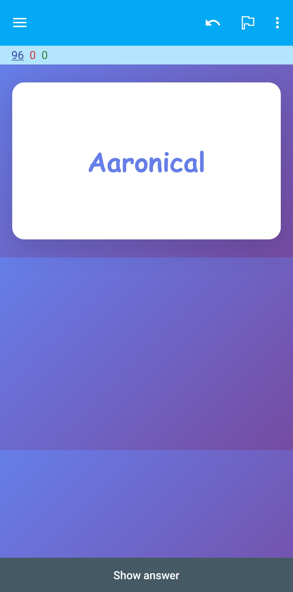
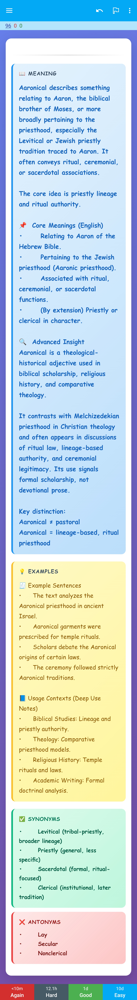

# Vocabulary Vault — Anki Flashcards

## Overview

Vocabulary Vault extends beyond vocabulary storage and organization.

The structured vocabulary database is used to build a dedicated **Anki
flashcard collection** designed for active recall, spaced repetition, and
long-term vocabulary retention.

Rather than reducing vocabulary learning to:

```text
Word → Definition
```

Vocabulary Vault cards can combine meaning, context, semantic distinctions,
grammar, examples, bilingual explanations, classification, and other
learning information into a structured revision experience.

> **The complete Vocabulary Vault Anki collection is distributed separately
> and is not included in this public repository.**

---

## Learning Workflow

Vocabulary Vault and Anki serve different purposes within the same learning
system.

```text
                 Vocabulary Vault
                        │
                        ▼
              Structured Vocabulary
                        │
                        ▼
                Flashcard Design
                        │
                        ▼
                      Anki
                        │
              ┌─────────┴─────────┐
              ▼                   ▼
         Active Recall      Spaced Repetition
              │                   │
              └─────────┬─────────┘
                        ▼
               Long-Term Retention
```

Vocabulary Vault manages and structures the information.

Anki provides the review and spaced-repetition environment.

---

# Flashcard Structure

Vocabulary Vault cards are designed to provide more context than conventional
single-definition flashcards.

Depending on the card type and vocabulary entry, information may include:

- Word or phrase
- Meaning in English
- Core meanings
- Advanced insight
- Semantic distinctions
- Example usage
- Usage contexts
- Synonyms
- Antonyms
- Part of speech
- Hindi meaning
- Difficulty classification
- CEFR reference
- Entry metadata

Not every card necessarily contains every field.

The information shown depends on the vocabulary item and the flashcard
design being used.

---

# Card Collections

Vocabulary Vault uses different card designs for different levels of
learning depth.

The two principal concepts are:

```text
Vocabulary Vault — Core
Vocabulary Vault — Mastery
```

---

## Vocabulary Vault — Core

**Core** cards are designed for faster vocabulary acquisition and revision.

The objective is to provide the most important information without requiring
the learner to process the complete linguistic analysis of an entry.

A Core card can focus on information such as:

```text
Word / Phrase
      │
      ▼
Meaning
      │
      ├── Example Usage
      ├── Synonyms
      └── Antonyms
```

This design is particularly useful for:

- Rapid vocabulary acquisition
- Daily revision
- Recognition practice
- Meaning recall
- Building a larger active vocabulary
- Shorter review sessions

### Core Card — Front



The front intentionally keeps the prompt minimal so that the learner must
attempt recall before seeing the answer.

### Core Card — Back



The reverse side provides the information required to verify and reinforce
the recalled meaning.

---

# Vocabulary Vault — Mastery

**Mastery** cards provide the richer Vocabulary Vault learning experience.

They are designed for vocabulary that benefits from deeper semantic,
grammatical, contextual, or bilingual information.

A Mastery card can conceptually contain:

```text
                    Word / Phrase
                          │
          ┌───────────────┼───────────────┐
          ▼               ▼               ▼
       Meaning       Classification     Grammar
          │               │               │
          ▼               ▼               ▼
    Core Meanings      Difficulty     Part of Speech
          │             / CEFR             │
          ▼                                 ▼
   Advanced Insight                    Usage Context
          │
          ▼
    Key Distinction
          │
          ▼
     Example Usage
          │
    ┌─────┼─────┐
    ▼     ▼     ▼
 Synonyms Hindi Antonyms
```

Mastery cards are intended for:

- Advanced vocabulary study
- Deeper semantic understanding
- Contextual learning
- Academic vocabulary
- Literary vocabulary
- Precise synonym distinctions
- Bilingual reinforcement
- Long-term mastery

### Mastery Card — Front


The front can include supporting classification information while keeping
the vocabulary item itself as the primary recall prompt.

### Mastery Card — Back


The answer side provides a richer structured explanation for learning and
revision.

---

# Vocabulary Information

## Meaning in English

Each card begins with a clear English explanation intended to communicate
both the definition and the central semantic idea of the vocabulary item.

The objective is understanding rather than simply memorizing a short
dictionary gloss.

---

## Core Meanings

Words can contain several closely related senses.

Core meanings separate the most important interpretations so that the
learner can understand the semantic range of the vocabulary item.

Conceptually:

```text
Word
 │
 ├── Primary Meaning
 ├── Secondary Meaning
 └── Contextual Meaning
```

---

## Advanced Insight

Where appropriate, advanced cards can provide additional linguistic context.

This can include:

- Etymology or origin
- Semantic development
- Historical usage
- Domain-specific usage
- Register
- Literary usage
- Technical usage
- Related forms
- Important nuances

This section is particularly useful for advanced and unusual vocabulary.

---

## Key Distinction

Similar words are not necessarily interchangeable.

Vocabulary Vault can therefore explicitly distinguish closely related terms.

Conceptually:

```text
Word A ≠ Word B
```

followed by the semantic or contextual distinction between them.

This helps prevent a common vocabulary-learning problem:

```text
Knowing the definition
        ≠
Knowing exactly when to use the word
```

---

## Example Usage

Vocabulary is reinforced through contextual examples rather than definitions
alone.

Examples demonstrate how the vocabulary behaves naturally inside sentences.

Where useful, usage may also be represented across different temporal
contexts:

```text
Past
Present
Future
```

---

## Usage Contexts

Context information helps explain where a vocabulary item is likely to be
encountered.

Possible contexts include:

```text
Everyday English
Academic Writing
Literature
Business
Technology
Law
History
Science
Religion
Formal Communication
Informal Communication
Professional Communication
```

---

## Synonyms and Antonyms

Synonyms create semantic connections between related vocabulary.

Antonyms reinforce meaning through contrast.

Together:

```text
             Synonyms
                │
                ▼
Vocabulary ← Meaning → Contrast
                ▲
                │
             Antonyms
```

This creates a stronger semantic network than memorizing isolated words.

---

## Part of Speech

Cards can identify the grammatical function of a vocabulary item.

Examples include:

```text
Noun
Verb
Adjective
Adverb
Phrase
Idiomatic Expression
```

Additional grammatical information can be included where it contributes to
correct usage.

---

## Hindi Meaning

Selected cards include Hindi explanations as an additional semantic
reference.

The Hindi field is intended to complement the English explanation rather
than replace it.

Conceptually:

```text
English Explanation
        +
Context
        +
Hindi Reference
        ↓
Stronger Semantic Understanding
```

---

# Difficulty Classification

Vocabulary Vault uses its own practical difficulty-classification system.

| Classification | General Description |
|---|---|
| **Easy** | Common everyday vocabulary |
| **Medium** | Standard vocabulary with moderate semantic depth |
| **Hard** | Advanced academic, literary, formal, or complex vocabulary |
| **Shashi Tharoor** | Rare, erudite, ornate, literary, or exceptionally sophisticated vocabulary |

Difficulty information can be incorporated into the flashcard design to
help learners understand the relative complexity of an entry.

For the complete system, see:

[Vocabulary Classification System](VOCABULARY-LEVELS.md)

---

# CEFR References

Vocabulary entries can also use approximate CEFR references:

```text
A1
A2
B1
B2
C1
C2
```

CEFR references and Vocabulary Vault difficulty are separate classifications.

For example:

```text
Vocabulary Vault Difficulty
          +
      CEFR Reference
          +
          Tags
          ↓
Detailed Classification
```

These references are used for learning and organization and should not be
interpreted as formal assessments of an individual learner's CEFR
proficiency.

---

# Card Design Philosophy

The flashcard interface follows a recall-first approach.

The front should provide enough information to identify the vocabulary item
without immediately revealing its explanation.

```text
FRONT
  │
  ▼
Attempt Recall
  │
  ▼
Reveal Answer
  │
  ▼
Compare Understanding
  │
  ▼
Review Context
  │
  ▼
Schedule Next Review
```

The back then provides enough information to correct or deepen the learner's
understanding.

This preserves the active-recall element that makes flashcards useful.

---

# Why Structured Cards?

A conventional vocabulary flashcard may contain:

```text
Word
 ↓
Definition
```

Vocabulary Vault aims for a richer model:

```text
                    WORD
                     │
       ┌─────────────┼─────────────┐
       ▼             ▼             ▼
    Meaning        Context       Grammar
       │             │             │
       ▼             ▼             ▼
    Examples       Usage       Part of Speech
       │
       ├─────────────┬─────────────┐
       ▼             ▼             ▼
   Synonyms       Antonyms       Hindi
       │
       ▼
 Advanced Understanding
```

The objective is not merely to recognize the word.

The objective is to progressively understand:

```text
What it means
      ↓
How it is used
      ↓
Where it is used
      ↓
How it differs from similar words
      ↓
How to recall it
      ↓
How to retain it
```

---

# Anki Ecosystem

The collection is designed for the Anki spaced-repetition ecosystem.

Depending on platform and compatibility, learners can use appropriate Anki
clients to review the cards.

Anki handles the revision schedule while Vocabulary Vault supplies the
structured learning material.

The public screenshots demonstrate representative card designs and do not
constitute the complete collection.

---

# AnkiWeb

Selected Vocabulary Vault flashcard resources and public Anki material can
be found through the author's AnkiWeb page:

https://ankiweb.net/shared/by-author/1443764638

The availability of individual decks on AnkiWeb may differ from the complete
Vocabulary Vault collection.

---

# Availability

The **complete Vocabulary Vault Anki flashcard collection is not included in
this GitHub repository**.

The full collection is maintained and distributed separately.

This repository contains documentation, architecture information,
classification information, screenshots, and representative examples so
that the project and learning system can be understood without distributing
the complete commercial collection.

```text
GitHub Repository
      │
      ├── Documentation
      ├── Architecture
      ├── Classification System
      ├── Screenshots
      └── Card Previews

Complete Anki Collection
      │
      └── Distributed Separately
```

---

# Purchase and Access

The complete Vocabulary Vault Anki collection is available separately as a
**paid digital resource**.

For current availability, pricing, licensing information, or access,
contact:

**Somesh Diwan**

**Email:** someshdiwan@icloud.com

When contacting, use:

```text
Subject:
Vocabulary Vault — Anki Flashcards

Message:
Hi Somesh,

I'm interested in the complete Vocabulary Vault Anki flashcard collection.

Please send me the current availability and pricing information.
```

You can also review the author's AnkiWeb resources:

https://ankiweb.net/shared/by-author/1443764638

---

# Distribution and Usage

Access to the complete Anki collection does not by itself grant permission
to redistribute or commercially exploit the collection.

Unless separate terms explicitly permit otherwise, purchasers should not:

- Resell the complete collection
- Redistribute deck files
- Upload the complete collection publicly
- Repackage the cards for resale
- Sell modified copies of the collection
- Claim the card design or original educational content as their own
- Distribute purchased files through public or private file-sharing services

Specific terms supplied with the purchased collection take precedence where
applicable.

---

# Corrections and Feedback

Vocabulary Vault is continuously reviewed and improved.

If you identify a possible issue involving:

- English meaning
- Example usage
- Semantic distinction
- Synonym
- Antonym
- Hindi meaning
- Grammar
- Part of speech
- Difficulty classification
- CEFR reference
- Card formatting

please report it through the GitHub repository or contact:

**someshdiwan@icloud.com**

When reporting vocabulary information, including the affected word and a
reliable reference is helpful.

---

# Related Resources

- [Vocabulary Classification System](VOCABULARY-LEVELS.md)
- [System Architecture](ARCHITECTURE.md)
- [Vocabulary Vault — Google Sheets](https://docs.google.com/spreadsheets/d/14Ag_rNUwVP-BIjj0KJyLUjOb-VFecCvsH6yBcZWnOAs/edit?gid=584521556#gid=584521556)
- [Vocabulary Submission Form](https://docs.google.com/forms/d/e/1FAIpQLSeurdy8PW2JJQ8Qgj77r1_EF578bXiGnSthQSRPRaypi5BNMQ/viewform?usp=header)
- [Original Vocabulary Vault — Notion](https://vocabulary-english.notion.site/English-Vocabulary-21ce0aa0c4d380b7b73af79235b5016c)
- [AnkiWeb — Somesh Diwan](https://ankiweb.net/shared/by-author/1443764638)

---

## Notice

Vocabulary Vault, its custom flashcard designs, structured educational
content, and complete Anki collection are separate from the public
source-code components of this repository.

Publication of screenshots, documentation, or representative examples in
this repository should not be interpreted as publication of the complete
commercial flashcard collection.

---

<p align="center">
  <strong>Vocabulary Vault</strong><br>
  Build • Learn • Retain
</p>